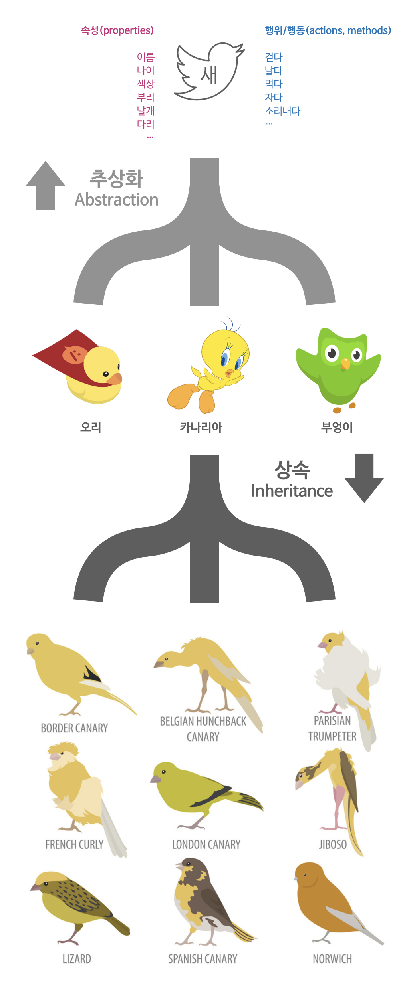
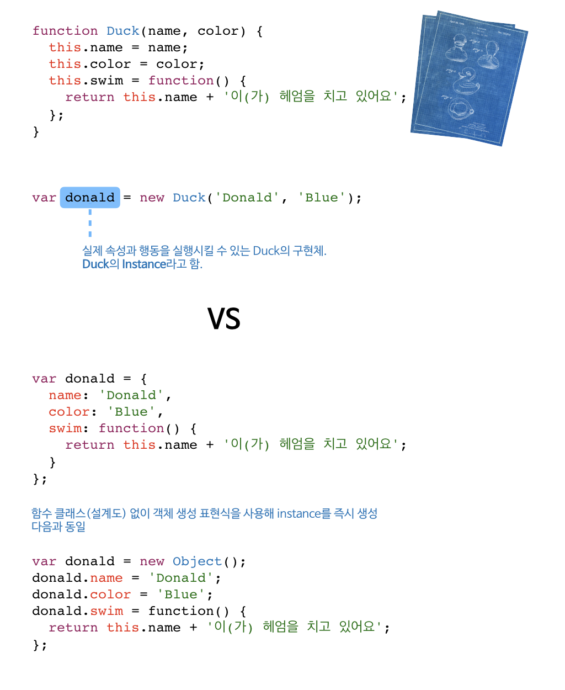

# 객체지향프로그래밍(Object Oritented Programming)

## 추상화(Abstraction)와 상속(Inheritance)


## 객체의 내부 구성요소

```javascript
{
  constructor: function Object(){},
  hasOwnProperty: function hasOwnProperty(){},
  isPrototypeOf: function isPrototypeOf(){},
  propertyIsEnumerable: function propertyIsEnumerable(){},
  toLocaleString: function toLocaleString(){},
  toString: function toString(){},
  valueOf: function valueOf(){},
  __defineGetter__: function __defineGetter__(){},
  __defineSetter__: function __defineSetter__(){},
  __lookupGetter__: function __lookupGetter__(){},
  __lookupSetter__: function __lookupSetter__(){},
  __proto__: {}
};

```


## 객체를 생성하는 방법(오리를 만드는 방법)


```javascript
// 인스턴스를 바로 생성해서 속성을 추가
var rubberDuck = new Object();// 리터럴 표현식: {}
rubberDuck.name = '러버덕';
rubberDuck['color'] = 'Yellow';
rubberDuck.swim = function() {
  return this.name + '이(가) 헤엄을 치고 있어요';
}

console.log(rubberDuck.swim());


// 함수 클래스를 정의한 후 인스턴스를 생성
function Duck(name, color) {
  this.name = name;
  this.color = color;
  this.swim = function() {
  	return this.name + '이(가) 헤엄을 치고 있어요';
  };
}

var donald = new Duck('도날드', 'Blue');

console.log(donald.swim());

// 함수 클래스에 prototype을 이용한 속성/행위 추가
Duck.prototype.say = function() {
  return this.name + '이(가) 꽥~꽥~';
}

console.log(donald.say());

var daisy = new Duck('Daisy', 'Pink');

console.log(daisy.say());

//Uncaught Type Error: rubberDuck.say is not a function
console.log(rubberDuck.say());
```

### 상위 객체 호출을 통한 상속
```javascript
function Bird(name) {
  this.name = name;
  this.fly = function() {
    return this.name + '이(가) 날고 있어요.';
  }
}

function Duck(name) {
  Bird.call(this, name);

  this.swim = function() {
    return this.name + '이(가) 헤엄을 치고 있어요';
  };
}

var donald = new Duck('Donald');
console.log(donald.fly());
console.log(donald.swim());

// 문제점
// Bird의 prototype에 속성이 추가된다면...
Bird.prototype.eat = function(food) {
  return this.name + '이(가) ' + food + '를 먹고 있어요.';
};

donal.eat('코코아');
```

### 상위 객체의 prototype을 이용한 상속
```javascript
function Bird(name) {
  this.name = name;
  this.fly = function() {
    return this.name + '이(가) 날고 있어요.';
  }
}

function Duck(name) {
  this.name = name;
  this.swim = function() {
    return this.name + '이(가) 헤엄을 치고 있어요';
  };
}

Duck.prototype = Object.create(new Bird());

var donald = new Duck('Donald');

Bird.prototype.eat = function(food) {
  return this.name + '이(가) ' + food + '를 먹고 있어요.';
};

donald.eat('감자');
```

### Object의 `__proto__`를 이용한 상속
```javascript
var bird = {
  name: '',
  fly: function() {
    return this.name + '이(가) 날고 있어요';
  }
};
```
[Object.create(proto[, propertiesObject])](https://developer.mozilla.org/en-US/docs/Web/JavaScript/Reference/Global_Objects/Object/create)
```javascript
var duck = Object.create(bird);
console.log('duck.name:', duck.name);

duck.name = 'Donald';
console.log('duck.name:', duck.name);
console.log('duck.__proto__.name:', duck.name);

duck.fly();

bird.eat = function(food) {
  return this.name + '이(가) ' + food + '를 먹고 있어요.';
};

console.log('duck.eat("고구마"):', duck.eat('고구마'));
```
